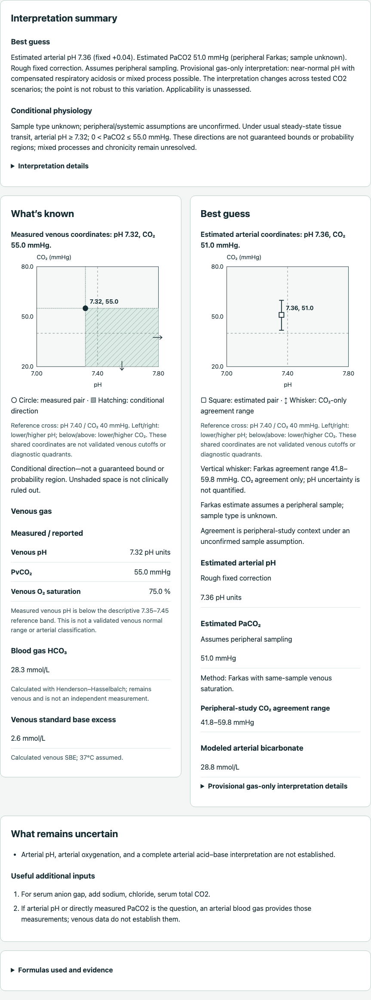
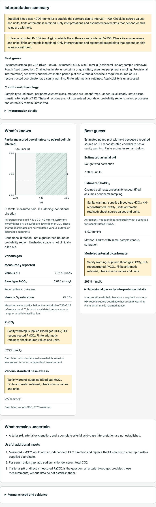

# v0.6.1 targeted-review verification

Synthetic software verification against the v0.6 baseline `aabf35d7990523b7fa268f37d5d867133b23399a`.
Equations and selection rules are unchanged. Request schema remains 5.0; result schema is 6.1.

| Sample | No saturation | Valid same-sample saturation |
| --- | --- | --- |
| Unknown | Fixed −5 mmHg | Farkas under an unconfirmed peripheral assumption |
| Peripheral | Fixed −5 mmHg | Farkas |
| Central | Fixed −5 mmHg | Fixed −5 mmHg; peripheral Farkas not applied |

pH uses the existing +0.04 correction. Supplied coordinates retain precedence over HH reconstruction.
A warning on a consumed operand or reconstructed coordinate retains finite numbers but withholds
dependent classification, sensitivity and the estimated paired plot. An unused warned third
coordinate leaves a supplied pH/PvCO2 pair eligible. Independent measured shading stays available.

The review's pH 7.32 / gas HCO3 270 / saturation 75% case now retains reconstructed PvCO2
523.8722434945687 and PaCO2 519.9122434945687 mmHg, with source and reconstructed-coordinate
warnings and no classification or estimated paired marker. pH 7.00 / HCO3 95 also warns on its
reconstructed PvCO2 of 385.11038475010264 mmHg despite unflagged supplied operands.

Checks performed on 2026-09-14:

- `uv sync --locked`: passed; only the package version changed in the lockfile.
- `make verify`: 4,057 Python checks and 30 Chromium browser checks passed; format, lint and
  self-hosted Pyodide inventory verification passed.
- `make validation`: 4,014 checks passed.
- `git diff --check`: passed.
- After the final plot-message refinement, four focused real-Pyodide checks passed, including
  loaded worker, rendering modules, selector, observations, narrative, estimator and version bytes.
- Existing availability matrix: 3,072 cases, including 2,976 admitted requests and 96 required-VBG
  rejections. Existing provenance/BE/timing, pressure/saturation, and albumin/chemistry products remain.
- Added 18 relationship/dependency regressions and five browser checks. Tests include equivalent
  supplied/derived extremes, both reconstruction directions, inclusive boundaries, original units,
  independent arithmetic, reported SBE precedence, optional refusal visibility, keyboard expansion,
  mobile overflow, reset and coherent withheld-plot labels. No branch-coverage percentage was collected.

The owner's targeted ZIP supplied reproduction cases; its contract doubles and copied production
modules were not added. Tests exercise strict mapping, the actual interpreter, deterministic finite
serialization and the real self-hosted Pyodide worker.

These screenshots were generated by this repository's Playwright tests from synthetic fixtures in
a local v0.6.1 build (commit unbound). They depict project UI and follow the repository license.
They are local acceptance evidence, not live-site or clinical validation. CI and Pages receipts
belong in the PR; direct hosted-browser acceptance remains a separate check.

## Default Unknown with saturation

## Warned reconstructed CO2

